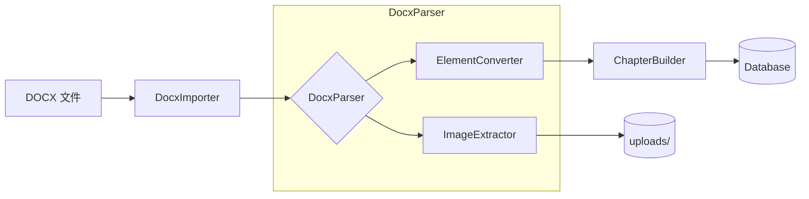

# DOCX 导入功能实现方案

## 目标描述

实现 DOCX 文件导入功能，通过接口上传 DOCX 文件，后端解析文件结构，根据配置的标题级别自动创建章节，将内容以 JSON 格式存入 `content` 字段，样式存入 `stylesheet` 字段。

---

## 需要用户确认

> [!IMPORTANT]
> **文件大小限制**：当前配置 `MAX_UPLOAD_SIZE=10MB`，是否需要调整？

---

## 实现方案

### 整体架构



---

### 1. 配置模块

#### [MODIFY] [.env.example](file:///g:/aicode/word_online/backend/.env.example)

新增 DOCX 导入相关配置：

```diff
+# DOCX 导入配置
+DOCX_IMPORT_MAX_HEADING_LEVEL=2
+DOCX_IMPORT_DEFAULT_CHAPTER_TITLE=默认章节
```

#### [MODIFY] [config/__init__.py](file:///g:/aicode/word_online/backend/app/config/__init__.py) 或新建配置类

添加导入配置读取逻辑。

---

### 2. 核心服务模块

#### 目录结构

```
app/services/docx_importer/
├── __init__.py              # 导出入口
├── importer.py              # 主导入类（DocxImporter）
├── parser.py                # DOCX 解析器（DocxParser）
├── element_converter.py     # 元素转换器（将 docx 元素转 Block）
├── image_extractor.py       # 图片提取器
├── chapter_builder.py       # 章节构建器
└── config.py                # 配置读取
```

---

#### [NEW] [importer.py](file:///g:/aicode/word_online/backend/app/services/docx_importer/importer.py)

主导入类，负责协调整体流程：

```python
class DocxImporter:
    """
    DOCX 导入器主类
    
    职责:
    1. 接收上传的 DOCX 文件
    2. 调用 DocxParser 解析文档结构
    3. 调用 ChapterBuilder 根据标题拆分章节
    4. 创建 Document、Chapters、DocumentSettings
    """
    
    def __init__(
        self,
        file_content: bytes,
        filename: str,
        max_heading_level: int = None,
        document_title: str = None
    ):
        pass
    
    def import_document(self, db: Session) -> ImportResult:
        """执行导入，返回导入结果"""
        pass
```

**核心流程**:

1. 验证文件格式和大小
2. 调用 `DocxParser` 解析 DOCX 结构
3. 调用 `ImageExtractor` 提取并保存图片
4. 调用 `ChapterBuilder` 按标题拆分内容
5. 创建 `Document` 记录
6. 创建 `DocumentSettings` 记录（页面设置）
7. 批量创建 `Chapter` 记录

---

#### [NEW] [parser.py](file:///g:/aicode/word_online/backend/app/services/docx_importer/parser.py)

DOCX 解析器，基于 `python-docx` 库：

```python
class DocxParser:
    """
    DOCX 文档解析器
    
    使用 python-docx 库解析文档结构，提取：
    1. 段落和标题（Paragraph）
    2. 表格（Table）
    3. 图片（InlineShape）
    4. 文本格式（Run properties）
    5. 段落格式（Paragraph properties）
    6. 页面设置（Section properties）
    """
    
    def __init__(self, file_content: bytes):
        self.doc = Document(io.BytesIO(file_content))
    
    def parse(self) -> DocxParseResult:
        """
        解析文档，返回结构化结果
        
        Returns:
            DocxParseResult:
                - elements: List[DocxElement]  # 按顺序的文档元素
                - page_settings: PageSettings  # 页面设置
                - images: Dict[str, bytes]     # 图片数据 {rId: bytes}
        """
        pass
```

**关键方法**:

| 方法 | 说明 |
|------|------|
| `_parse_paragraph(p)` | 解析段落/标题，提取文本和格式 |
| `_parse_table(table)` | 解析表格，提取单元格和合并信息 |
| `_parse_run(run)` | 解析文本 Run，提取内联格式 |
| `_extract_images()` | 提取文档中的图片 |
| `_get_page_settings()` | 提取页面设置 |

---

#### [NEW] [element_converter.py](file:///g:/aicode/word_online/backend/app/services/docx_importer/element_converter.py)

将 DOCX 元素转换为 Content/StyleSheet JSON 结构：

```python
class ElementConverter:
    """
    DOCX 元素到 Content Block 转换器
    
    复用现有的数据模型:
    - ParagraphBlock, HeadingBlock, TableBlock, ImageBlock
    - SimpleMark, ValueMark, LinkMark
    - StyleSheet, StyleRule
    """
    
    def convert_paragraph(self, docx_para, images_map) -> Tuple[Block, List[StyleRule]]:
        """转换段落/标题"""
        pass
    
    def convert_table(self, docx_table) -> Tuple[TableBlock, List[StyleRule]]:
        """转换表格"""
        pass
    
    def convert_image(self, image_data, image_path) -> ImageBlock:
        """转换图片"""
        pass
```

**格式映射表**:

| DOCX 属性 | python-docx 访问方式 | 转换目标 |
|-----------|---------------------|----------|
| 加粗 | `run.bold` | `SimpleMark(type="bold")` |
| 斜体 | `run.italic` | `SimpleMark(type="italic")` |
| 下划线 | `run.underline` | `SimpleMark(type="underline")` |
| 删除线 | `run.font.strike` | `SimpleMark(type="strike")` |
| 上标 | `run.font.superscript` | `SimpleMark(type="superscript")` |
| 下标 | `run.font.subscript` | `SimpleMark(type="subscript")` |
| 字体颜色 | `run.font.color.rgb` | `ValueMark(type="color")` |
| 字号 | `run.font.size` | `ValueMark(type="fontSize")` |
| 字体 | `run.font.name` | `ValueMark(type="fontFamily")` |
| 背景色 | `run.font.highlight_color` | `ValueMark(type="backgroundColor")` |
| 超链接 | `run.hyperlink` | `LinkMark(type="link")` |
| 对齐方式 | `para.alignment` | `StyleRule(textAlign)` |
| 首行缩进 | `para.paragraph_format.first_line_indent` | `StyleRule(textIndent)` |
| 行间距 | `para.paragraph_format.line_spacing` | `StyleRule(lineHeight)` |
| 段前间距 | `para.paragraph_format.space_before` | `StyleRule(marginTop)` |
| 段后间距 | `para.paragraph_format.space_after` | `StyleRule(marginBottom)` |

---

#### [NEW] [chapter_builder.py](file:///g:/aicode/word_online/backend/app/services/docx_importer/chapter_builder.py)

根据标题级别构建章节树：

```python
class ChapterBuilder:
    """
    章节构建器
    
    根据配置的 max_heading_level 将文档元素拆分为章节:
    - H1 ~ H{max_level} 作为章节标题
    - H{max_level+1} ~ H6 作为章节内容中的 HeadingBlock
    - 首内容非标题时创建默认章节
    """
    
    def __init__(self, elements: List[Block], style_rules: List[StyleRule], max_heading_level: int):
        self.elements = elements
        self.style_rules = style_rules
        self.max_level = max_heading_level
    
    def build(self) -> List[ChapterData]:
        """
        构建章节列表
        
        Returns:
            List[ChapterData]:
                - title: str
                - level: int
                - parent_id: Optional[str]
                - order_index: int
                - content: Content
                - stylesheet: StyleSheet
        """
        pass
```

**章节构建逻辑**:

```
1. 遍历所有 Block
2. 遇到 HeadingBlock 且 level <= max_heading_level:
   - 结束当前章节
   - 创建新章节，标题 = heading.text
   - 确定父章节（向前查找最近的更低级标题）
3. 遇到其他 Block:
   - 加入当前章节的 content.blocks
4. 处理结束后，如果还有未分配的 Block:
   - 创建默认章节
```

---

#### [NEW] [image_extractor.py](file:///g:/aicode/word_online/backend/app/services/docx_importer/image_extractor.py)

提取并保存图片：

```python
class ImageExtractor:
    """
    图片提取器
    
    1. 从 DOCX 中提取嵌入图片
    2. 保存到 uploads/images/{doc_id}/
    3. 返回图片路径映射
    """
    
    def __init__(self, doc_id: str, upload_dir: str = "./uploads"):
        self.doc_id = doc_id
        self.upload_dir = upload_dir
    
    def extract_and_save(self, images: Dict[str, bytes]) -> Dict[str, str]:
        """
        提取并保存图片
        
        Args:
            images: {rId: image_bytes} 映射
            
        Returns:
            {rId: "/api/v1/assets/images/{doc_id}/{filename}"} 映射
        """
        pass
```

---

### 3. API 接口

#### [NEW] [import.py](file:///g:/aicode/word_online/backend/app/api/v1/import.py)

新增导入 API：

```python
from fastapi import APIRouter, Depends, HTTPException, UploadFile, File, Form
from sqlalchemy.orm import Session
from typing import Optional

from app.core.database import get_db
from app.services.docx_importer import DocxImporter

router = APIRouter(prefix="/api/v1/documents", tags=["import"])


@router.post("/import", response_model=ImportResponse, status_code=201)
async def import_docx(
    file: UploadFile = File(..., description="DOCX 文件"),
    max_heading_level: Optional[int] = Form(None, ge=1, le=6, description="最大章节标题级别"),
    document_title: Optional[str] = Form(None, description="文档标题"),
    db: Session = Depends(get_db)
):
    """
    导入 DOCX 文件
    
    - 上传 DOCX 文件
    - 根据标题级别自动创建章节
    - 返回创建的文档和章节信息
    """
    # 验证文件类型
    if not file.filename.endswith('.docx'):
        raise HTTPException(status_code=400, detail="仅支持 .docx 格式文件")
    
    # 读取文件内容
    content = await file.read()
    
    # 验证文件大小
    max_size = int(os.getenv("MAX_UPLOAD_SIZE", 10 * 1024 * 1024))
    if len(content) > max_size:
        raise HTTPException(
            status_code=413, 
            detail=f"文件大小超过限制（{max_size // 1024 // 1024}MB）"
        )
    
    try:
        # 执行导入
        importer = DocxImporter(
            file_content=content,
            filename=file.filename,
            max_heading_level=max_heading_level,
            document_title=document_title
        )
        result = importer.import_document(db)
        
        return ImportResponse(
            doc_id=result.doc_id,
            title=result.title,
            chapters=result.chapters,
            message=f"导入成功，共创建 {len(result.chapters)} 个章节"
        )
    except Exception as e:
        raise HTTPException(status_code=500, detail=f"文档解析失败: {str(e)}")
```

#### [MODIFY] [main.py](file:///g:/aicode/word_online/backend/app/main.py)

注册新路由：

```diff
 from app.api.v1 import documents, chapters, export, upload, document_settings
+from app.api.v1 import import as docx_import

 # 注册路由
 app.include_router(documents.router)
 app.include_router(chapters.router)
+app.include_router(docx_import.router)
```

---

### 4. 数据模型

#### [MODIFY] [schemas.py](file:///g:/aicode/word_online/backend/app/models/schemas.py)

新增导入相关的 Schema：

```python
class ImportChapterInfo(BaseModel):
    """导入结果中的章节信息"""
    id: str
    title: str
    level: int
    order_index: int
    parent_id: Optional[str] = None


class ImportResponse(BaseModel):
    """导入响应"""
    doc_id: str
    title: str
    chapters: List[ImportChapterInfo]
    message: str
```

---

### 5. 依赖管理

#### [MODIFY] [requirements.txt](file:///g:/aicode/word_online/backend/requirements.txt)

添加 python-docx 依赖：

```diff
+python-docx>=1.1.0
```

---

## 验证计划

### 自动化测试

#### [NEW] 单元测试: `tests/test_docx_importer.py`

```python
# 测试用例覆盖:
1. test_parse_simple_paragraph      # 简单段落解析
2. test_parse_formatted_text        # 格式化文本（加粗、斜体等）
3. test_parse_heading_levels        # 标题级别识别
4. test_parse_table_with_merge      # 表格与合并单元格
5. test_parse_list                  # 列表解析
6. test_chapter_building_by_h1      # 按 H1 分章节
7. test_chapter_building_by_h2      # 按 H1+H2 分章节
8. test_default_chapter_creation    # 无标题时创建默认章节
9. test_content_before_first_heading # 首内容非标题
10. test_image_extraction           # 图片提取
```

**运行命令**:
```bash
cd g:\aicode\word_online\backend
pytest tests/test_docx_importer.py -v
```

---

### 手动测试

#### 测试步骤

1. **准备测试文件**: 创建包含以下内容的 `test.docx`:
   - 2 个一级标题 (H1)
   - 每个 H1 下有 1 个二级标题 (H2)
   - 包含加粗、斜体、颜色等格式
   - 包含 1 个表格（含合并单元格）
   - 包含 1 张图片

2. **启动后端服务**:
   ```bash
   cd g:\aicode\word_online\backend
   python -m app.main
   ```

3. **使用 curl 测试接口**:
   ```bash
   curl -X POST "http://localhost:8000/api/v1/documents/import" \
     -F "file=@test.docx" \
     -F "max_heading_level=2"
   ```

4. **验证响应**: 确认返回了文档 ID 和章节列表

5. **验证数据**: 使用已有 API 获取章节详情，确认格式正确：
   ```bash
   curl "http://localhost:8000/api/v1/chapters/{chapter_id}"
   ```

6. **验证图片**: 访问图片路径确认可访问

---

## 实现顺序

| 阶段 | 任务 | 预计工作量 |
|------|------|-----------|
| 1 | 添加依赖和配置 | 0.5h |
| 2 | 实现 `DocxParser` - 文档解析 | 2h |
| 3 | 实现 `ElementConverter` - 格式转换 | 3h |
| 4 | 实现 `ChapterBuilder` - 章节构建 | 1.5h |
| 5 | 实现 `ImageExtractor` - 图片提取 | 1h |
| 6 | 实现 `DocxImporter` - 主导入类 | 1h |
| 7 | 实现 API 接口 | 1h |
| 8 | 编写单元测试 | 2h |
| 9 | 集成测试和修复 | 2h |

**总计**: 约 14 小时
